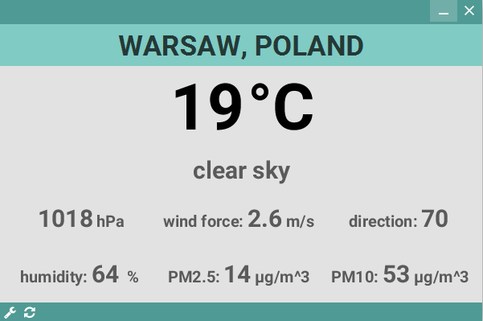

# Weather-Widget
Widget displaying current weather and air conditions in Warsaw, Poland. Uses JavaFX graphics library amongs others and is created using a reactive approach. 



Application needs JDK8 for successful compilation. In order to switch to JDK8 one can set environmental variables `JAVA_HOME` to JDK location and `PATH` to bin folder inside JDK location.

File pom.xml is a maven configuration file. Project can be built using:
```
mvn clean compile
```
And in case of a successfull compilation run with: 
```
mvn exec:java
```
